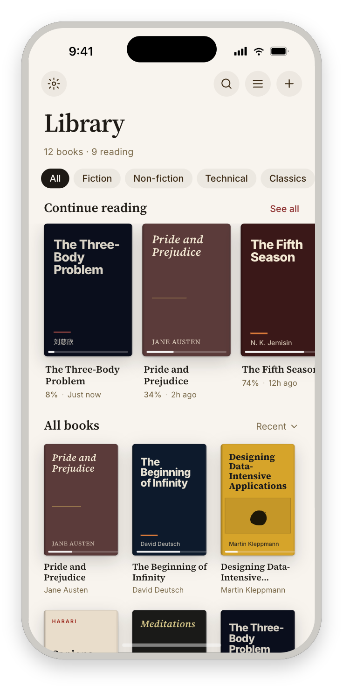
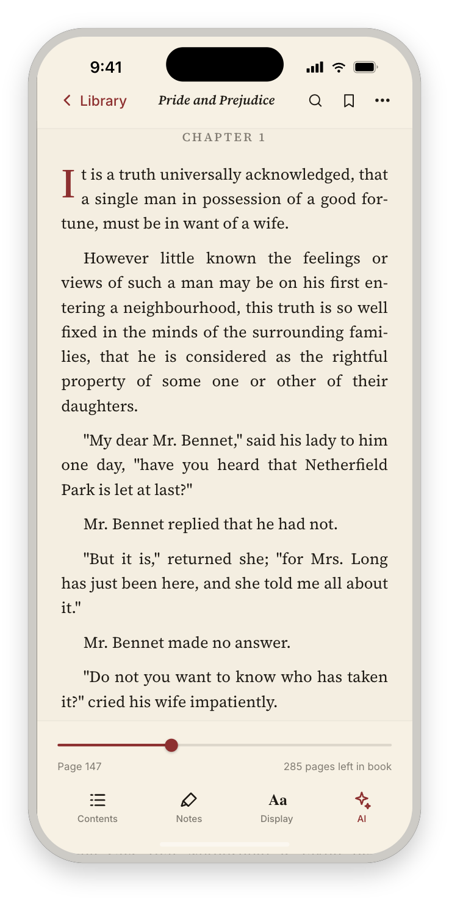
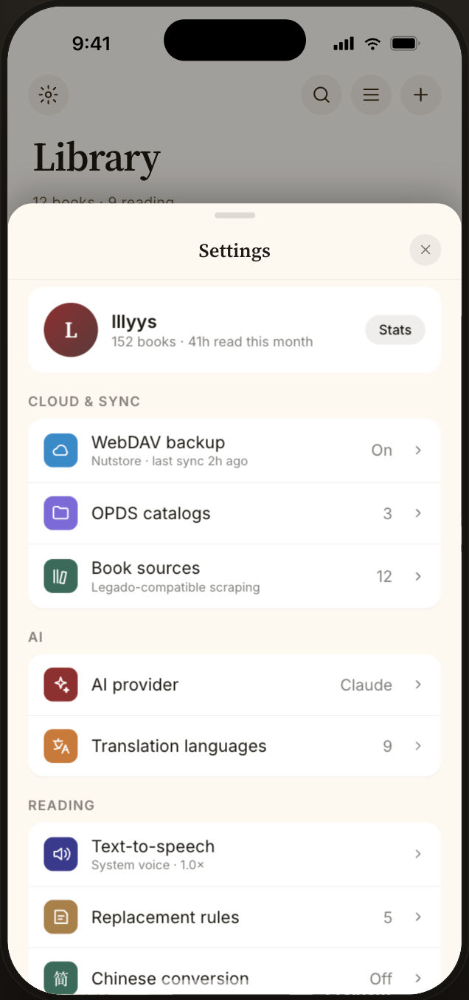

<p align="center">
  
</p>

# VReader

**Built entirely by AI — coded, tested, and debugged by AI agents. Human-directed.**

An iOS reader for EPUB, AZW3/MOBI (Kindle), PDF, TXT, and Markdown — built entirely by AI coding agents, with Swift 6, SwiftUI, and SwiftData.

## About

VReader is a modern reading app designed for iPhone and iPad, built entirely by AI coding agents (Claude Code + Codex CLI) with human direction on requirements and testing. It supports EPUB, AZW3/MOBI (Kindle), PDF, TXT, and Markdown with annotations, full-text search, AI assistant, TTS, book source scraping, and WebDAV backup.

## Screens

VReader's v2 visual identity — a reading-focused design system with a Source Serif / Inter type pairing, an oxblood accent, and five page themes (Paper, Sepia, Dark, OLED, Photo).

<table>
  <tr>
    <td align="center"></td>
    <td align="center"></td>
    <td align="center"></td>
  </tr>
  <tr>
    <td align="center">Library</td>
    <td align="center">Reading</td>
    <td align="center">Settings</td>
  </tr>
</table>

## Features

### Reading

- **Multi-format** — EPUB, AZW3/MOBI (Kindle), PDF, TXT, Markdown in a single app
- **AZW3/MOBI** — Kindle books via [Foliate-js](https://github.com/johnfactotum/foliate-js) engine (DRM-free only)
- **Per-format native rendering** — each format renders with a purpose-built native engine (UIKit / WebView bridges), selected automatically — no rendering-mode toggle to configure
- **Reading position** — Auto-saves scroll position, survives app kills and relaunches
- **CJK encoding** — Auto-detect GBK, Big5, Shift-JIS, EUC-KR (8KB sample-based)
- **Large file support** — Chunked UITableView for TXT files >500K characters
- **Paginated mode** — CSS columns (EPUB), TextKit containers (TXT/MD), PDFKit pages
- **Page turn animations** — Slide, cover-flip, or instant
- **Auto page turning** — Timer-based advancement with configurable interval

### Annotations

- **Bookmarks, highlights, notes** — Full CRUD for TXT/MD/PDF/EPUB; AZW3 in progress
- **EPUB highlights** — CSS Highlight API with JS bridge + buffered delivery
- **AZW3 highlights** — Selection capture + CFI anchoring shipped; overlay restoration deferred to WI-7
- **PDF highlights** — PDFAnnotation-based with selection detection
- **TXT/MD highlights** — NSAttributedString with persistent rendering
- **Tap-to-preview notes** — Tapping an annotated highlight shows its note inline (read-only preview) across all five formats; a long-press opens the edit/delete menu on TXT/MD/PDF
- **Export/import** — Markdown + JSON export, VReader JSON round-trip import

### Search & Navigation

- **Full-text search** — SQLite FTS5 with CJK tokenization, persistent index
- **Reading progress bar** — Draggable scrubber (continuous, page-based, chapter-based)
- **Table of contents** — EPUB nav/NCX, PDF outline, TXT auto-detection (25 Legado rules), MD headings
- **Dictionary** — System dictionary lookup + AI translation on text selection

### AI

- **Summarization** — scoped summaries (Section / Chapter / Book-so-far) via OpenAI-compatible API
- **Chat** — Multi-turn conversation with book context
- **Translation** — Bilingual view (9 languages)
- **General chat** — AI chat without book context

### Library

- **Grid/list view** — Persistent sort order and view mode
- **Cover art** — Auto-extracted from EPUB and AZW3 metadata
- **Collections** — Tags, series, custom groups
- **Custom covers** — Set from photo library
- **Context menu** — Info, share, set cover, delete
- **OPDS catalog** — Browse and download from OPDS 1.2 feeds
- **Book sources** — Legado-compatible rule engine for web novel scraping

### Text Processing

- **TTS** — System (AVSpeechSynthesizer) + cloud HTTP TTS with playback controls; all five formats, including AZW3/MOBI (whole-book text extracted from the Foliate engine)
- **TTS sentence highlight** — NLTokenizer-based sentence detection synced to speech position (TXT/MD)
- **TTS auto-scroll** — Text view follows speech position in real-time (TXT/MD)
- **Simp/Trad Chinese** — Toggle conversion via ICU (live re-apply without reloading)
- **Content replacement** — Regex rules for text cleanup (live re-apply via source text storage)
- **Reading time tracking** — Per-book session stats and speed calculations

### Sync & Backup

- **WebDAV backup** — Archive to any WebDAV server (Nutstore compatible). For a self-hosted Mac setup with iCloud Drive sync, see [`lllyys/vreader-webdav-host`](https://github.com/lllyys/vreader-webdav-host). Tailscale-fronted servers work over plain HTTP; if the Test Connection returns `502` while `localhost` succeeds, your Mac's system HTTP proxy is intercepting Tailscale traffic — add `*.ts.net` and `100.64.0.0/10` to its bypass list.
- **Per-book settings** — Font, theme, spacing overrides per book (JSON-persisted)
- **Theme backgrounds** — Custom background images via PhotosPicker with per-theme opacity

### Developer Tools (DEBUG-only)

- **DebugBridge** — `vreader-debug://` URL scheme for autonomous testing. Drives the app from outside via `xcrun simctl openurl`: reset library, seed fixtures, set theme, open books, snapshot state to JSON. Compiled out of Release builds. Reference: [`docs/subsystems/debug-bridge.md`](docs/subsystems/debug-bridge.md)

## Tech Stack

| Component   | Technology                                                                                      |
| ----------- | ----------------------------------------------------------------------------------------------- |
| UI          | SwiftUI                                                                                         |
| Persistence | SwiftData (SchemaV6)                                                                            |
| EPUB        | WKWebView bridge with CSS theme injection + JS highlight API                                    |
| AZW3/MOBI   | [Foliate-js](https://github.com/johnfactotum/foliate-js) in WKWebView (IIFE bundle via esbuild) |
| PDF         | PDFKit + PDFAnnotation for highlights                                                           |
| TXT         | TextKit 1 (UITextView) + chunked UITableView                                                    |
| Markdown    | NSAttributedString rendering via MDParser                                                       |
| Search      | SQLite FTS5 with CJK tokenization                                                               |
| AI          | OpenAI-compatible API (summarize, chat, translate)                                              |
| TTS         | AVSpeechSynthesizer + HTTP cloud TTS                                                            |
| Backup      | WebDAV client                                                                                   |
| Encoding    | ICU + heuristic detection (UTF-8/GBK/Big5/Shift-JIS)                                            |
| Concurrency | Swift 6 strict concurrency                                                                      |

## Requirements

- iOS 17.0+
- Xcode 16+
- [XcodeGen](https://github.com/yonaskolb/XcodeGen)

## Getting Started

```bash
# Generate the Xcode project
xcodegen generate

# Open in Xcode
open vreader.xcodeproj
```

Then select a simulator or device and run.

## Architecture

See [`docs/architecture.md`](docs/architecture.md) for the full architecture document.

```
vreader/
├── App/                 # App entry point, SwiftData schema init
├── Models/              # SwiftData models, DocumentFingerprint, Locator
├── ViewModels/          # Library and per-format reader view models
├── Views/
│   ├── Reader/          # Reader container, format bridges, chrome overlay
│   │   └── Annotations/ # TOCSheet, HighlightsSheet, AnnotationsSheetRoute
│   ├── Annotations/     # AddNoteSheet, AnnotationEditSheet
│   └── Settings/        # ReaderSettingsPanel, AI/TTS/WebDAV settings
├── Services/
│   ├── TXT/, EPUB/, MD/ # Format-specific parsing and loading
│   ├── Foliate/         # AZW3/MOBI via Foliate-js (scheme handler, adapters, JS bundle)
│   ├── Search/          # FTS5 indexing, text extraction
│   ├── AI/, TTS/        # AI service, TTS providers
│   ├── Backup/          # WebDAV client, BackupProvider
│   ├── Sync/            # CloudKit infrastructure (built but not wired — feature #10 WONT DO)
│   ├── DebugBridge/     # DEBUG-only: vreader-debug:// URL scheme + active-reader registry
│   ├── TextMapping/     # Simp/Trad, replacement rules
│   └── Locator/         # Reading position (Readium-inspired)
vreaderTests/            # XCTest unit tests (~90 unit-test methods plus integration suites)
vreaderUITests/          # UI tests (XCUITest)
```

### Key Design Decisions

- **Foliate-js for AZW3/MOBI** — Kindle books are parsed and rendered by [Foliate-js](https://github.com/johnfactotum/foliate-js) running in WKWebView. The entire library is bundled into a single 278KB IIFE via esbuild (WKWebView blocks ES modules on custom schemes). A `WKURLSchemeHandler` serves the JS bundle and book files from a single origin to avoid CORS issues.
- **Three-renderer architecture** — Each format uses the best tool: Foliate-js in WKWebView (AZW3/MOBI), custom WKWebView bridge (EPUB), PDFKit (PDF), UITextView (TXT/MD). Shared services (Locator, Highlight, Search, TTS, Position) work across all renderers.
- **CFI-based positions for EPUB/AZW3** — Foliate-js generates EPUB CFI strings for both EPUB and MOBI (fake CFIs for MOBI). These are stored in `Locator.cfi` as the authoritative position, enabling unified persistence and highlight anchoring.
- **TextKit 1 for TXT rendering** — UITextView with `NSLayoutManager` for reliable offset-to-scroll mapping. TextKit 2 has better performance but lacks the `charOffset ↔ scrollOffset` APIs needed for position persistence.
- **Chunked rendering for large files** — Files over 500K UTF-16 code units use a UITableView where each cell renders one \~16K chunk. Only visible cells build attributed strings (LRU cache of 20 chunks).
- **Two-phase scroll restore** — Position restore uses a Phase 1 (t+0.15s) + Phase 2 (t+0.8s) pattern to handle TextKit 1 compatibility mode relayout storms that reset `contentOffset`.
- **`@State` for one-shot values** — Rapidly-mutating `@Observable` properties are never read in SwiftUI body to avoid observation feedback loops. Position restore uses `@State` captured once after `open()`.
- **Background task protection** — `UIApplication.beginBackgroundTask` wraps all critical saves (`close()`, `onBackground()`) to prevent data loss when iOS suspends the process.

## AI-Powered Development

All code, tests, bug fixes, and documentation are produced by AI coding agents. The human role is directing requirements, reporting bugs, and verifying on device.

### Tools

| Tool                                          | Role                                                                |
| --------------------------------------------- | ------------------------------------------------------------------- |
| [Claude Code](https://claude.com/claude-code) | Primary coding agent — implementation, editing, code review, fixes  |
| [Codex CLI](https://github.com/openai/codex)  | Architecture review, auditing, autonomous implementation in sandbox |

### Workflow

The development process follows a gated, multi-agent pipeline:

1. **Plan** — Features are designed as detailed implementation plans with work items, acceptance criteria, and test requirements (`docs/codex-plans/`)
2. **Review** — Plans go through multi-round architecture review via Codex (consistency, completeness, feasibility, ambiguity, risk)
3. **Implement** — Work items are implemented by the implementer agent following TDD (RED-GREEN-REFACTOR)
4. **Audit** — Code is audited across 9 dimensions (correctness, security, concurrency, performance, etc.)
5. **Fix** — Audit findings are fixed and verified in iterative loops until clean
6. **Commit** — Changes are committed only on explicit request after passing all gates

### Agent Rules

Shared rules for all AI agents live in ``:

- **Test-first is mandatory** — Write a failing test before implementing any new behavior
- **Research before building** — Search for established patterns and proven solutions before inventing
- **Edge cases are not optional** — Brainstorm and test: empty input, null values, Unicode/CJK, concurrent access, network failures
- **Keep files under \~300 lines** — Split proactively to maintain readability
- **Keep diffs focused** — No drive-by refactors; only change what's needed

### Configuration

- `.claude/rules/` — Rule files for TDD, UI consistency, design tokens, keyboard shortcuts, version bumping
- `.claude/skills/` — Custom skill definitions (plan-audit, etc.)
- `CLAUDE.md` — Claude Code project instructions
- `AGENTS.md` — Shared instructions for all AI coding agents

## Status

Active development. See [features](docs/features.md) (52 done) and [bugs](docs/bugs.md) (211 fixed) for current state.

## License

MIT
