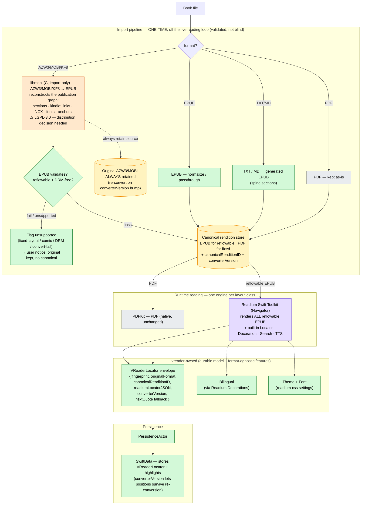
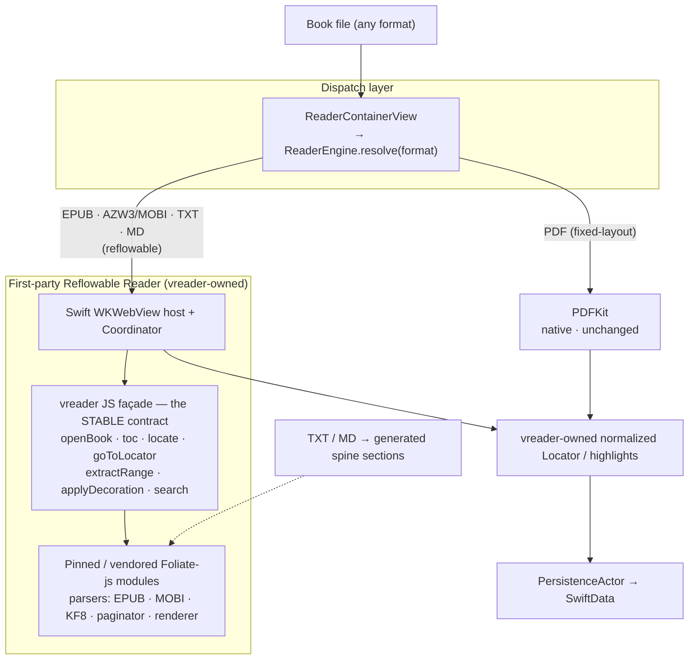

# Feature #42 (re-scoped) — Unified reader engine: Readium + libmobi (convert-on-import)

| | |
|---|---|
| **Feature** | #42 (re-scoped 2026-05-28; supersedes the deferred Foliate-js EPUB-swap scope) |
| **Status** | **PLANNED (audited)** 2026-05-29. Gate-1 COMPLETE; Gate-2 PASSED (3 rounds — accept at the rule-47 cap; zero open substantive Critical/High/Medium). Blockers cleared: licensing (user posture) + go-ahead ("go ahead with the goal"). Ready for Gate-3 (TDD, WI-1, in a worktree). |
| **Gate** | Gate 1 (Plan) — **COMPLETE**. Gate 2 (independent Codex audit, threads `019e6f85` r1 + `019e6f9c` r2/r3) — **PASSED** (3 rounds; see the round-1/2/3 records below). Next: Gate 3 (TDD, WI-1 SPM-add-Readium, in a worktree). |
| **Author** | claude (orchestrator) |
| **Provenance** | Converged from web research + four Codex consults (migration cost explicitly off the table). A formal Gate-2 audit of *this written plan* is still required before PLANNED. |

> **Scope guard.** This is a *direction-setting* Gate-1 draft. The file-by-file surface
> area, work-item sequencing, and test catalogue (the rest of the rule-47 Gate-1
> requirements) are sketched, not complete — see "Gate-1 completion TODO". Do **not** start
> Gate-3 implementation from this draft.

---

## Problem

vreader renders five formats across three engine families: TextKit (TXT/MD), a bespoke
`EPUBWebViewBridge` (EPUB), Foliate-js (`FoliateSpikeView`, AZW3/MOBI), and PDFKit (PDF).
The same visual effect (theme, font, highlight, bilingual, locator) is implemented 3+ times,
and the per-format divergence is the root of a recurring bug class — this session alone:
#260 (AZW3 chrome), #262/#1136 (AZW3 TOC/nav), #265 (AZW3 position not restored),
#266 (bilingual misalignment). The durable position/highlight model leaking each engine's
internal representation is the common thread.

**Goal:** one runtime reflowable engine + a vreader-owned, engine-agnostic locator/highlight
model, so the cross-format bug class collapses and appearance is modified in one place.

---

## Decision

**Adopt Option B — Readium Swift Toolkit as the single runtime reflowable engine; libmobi
converts AZW3/MOBI/KF8 → EPUB at import; PDFKit keeps PDF. Foliate-js, `EPUBWebViewBridge`,
and `FoliateSpikeView` are eliminated.**

Why B over the earlier Option A (first-party engine over vendored Foliate-js): Readium ships
the **standardized `Locator` model + Decoration (highlight) API + search + TTS** out of the
box — i.e. it *provides* the "stable position/highlight abstraction" that was Option A's #1
risk, rather than vreader building it over an explicitly-unstable JS upstream. Codex's
fourth-consult verdict: *"Use Readium as the only runtime reader engine for reflowable books;
treat Kindle formats as import formats, not render formats."*

---

## Target architecture (recommended — Option B)

**Legend:** 🟧 libmobi — import-only C dep (⚠ LGPL-3.0) · 🟪 Readium — mature 3rd-party runtime
engine · 🟩 vreader-owned · ⬜ native PDFKit · 🟨 canonical-rendition store.

### Load-bearing ideas

1. **Kindle is converted once at import** (`libmobi` AZW3/MOBI/KF8 → EPUB), off the live read
   loop — so the slow KF8 HUFF/CDIC decompression is paid once, not per-open, and no unstable
   parser runs in the read path.
2. **Readium is the single runtime reflowable engine** and *provides* Locator + Decoration +
   search + TTS — vreader inherits the hard abstraction instead of building it.
3. **vreader owns a thin `VReaderLocator` envelope** wrapping Readium's Locator JSON +
   `converterVersion`, so saved positions survive a future re-conversion. The durable model
   stays vreader's; never persist a raw engine-internal anchor.
4. **Kindle import is a *validated pipeline*, not a blind transform** (Codex's condition). The
   real fidelity risk is libmobi's *publication-graph reconstruction* (sections · `kindle:`
   links · NCX · embedded/deobfuscated fonts · hybrid KF7+KF8 · anchors) — NOT WebKit layout,
   which is identical to Foliate's (both render the same extracted KF8 HTML/CSS). Path: convert
   → EPUB-validate → pass ⇒ canonical store; fail / fixed-layout / DRM ⇒ flag + keep original.

### Delta vs today

- **Deletes:** `EPUBWebViewBridge` + bespoke JS; `FoliateSpikeView` + the dead
  `FoliateReaderContainerView`/`FoliateReaderHost` duplicate; the TextKit reader paths for
  TXT/MD; the whole Foliate-js vendored bundle.
- **Adds:** Readium Swift Toolkit (SPM); libmobi (vendored C + Swift binding, import-only);
  the import/conversion pipeline; `VReaderLocator`.
- **Keeps:** PDFKit, `PersistenceActor` / SwiftData (schema extended for `VReaderLocator`).

---

## Rejected alternatives

- **Option A — first-party reflowable engine over vendored Foliate-js** (the earlier draft;
  diagram retained below for the record). Rejected because it forces vreader to build and own
  the Locator/highlight abstraction (the #1 risk) over an explicitly-unstable JS upstream,
  whereas Readium supplies that abstraction. Foliate's only unique advantage — native Kindle
  *rendering* — is neutralised by the fact that nothing renders AZW3 "natively" anyway (KF8 is
  internally HTML/CSS; every engine extracts-and-renders), so libmobi convert-on-import gives
  comparable fidelity for DRM-free reflowable books.
- **Drop Kindle, Readium-only.** Cleanest foundation, but removes a vreader differentiator
  (AZW3/MOBI support). Only correct if the product decides Kindle is non-core.
- **One engine including PDF via pdf.js.** Rejected — PDFKit is the mature native fixed-layout
  engine; pdf.js adds JS memory/render-scheduling/fidelity cost for no pipeline gain.

Option A diagram (rejected — kept for the record)

---

## WI-0 decision-spike results (2026-05-29 — parallel research agents)

Two independent research agents ran the WI-0 spikes. Findings **resolve blocker #1** and
re-shape the architecture (libmobi is OUT):

- **libmobi → DROPPED.** Confirmed **LGPL-3.0-or-later, no linking exception**. For a
  closed-source App Store binary this is *effectively blocked*: LGPLv3 inherits GPLv3's
  anti-tivoization clause (user must be able to relink a modified lib + run it), which Apple's
  mandatory code-signing forbids — a dynamic `.framework` does **not** rescue it on iOS
  (precedent: VLC relicensed to LGPLv2.1, which lacks the clause, specifically to clear the App
  Store; libmobi is v3, the harder case). Community/legal consensus (Bradley Kuhn / LWN, FSF,
  Apple dev forums) is explicit.
- **Kindle path → reuse the MIT Foliate-js `mobi.js` already vendored.** vreader ships
  `mobi.js` (MIT, full KF8/AZW3 + HUFF/CDIC, powers `FoliateSpikeView` today). Convert-on-import
  can reuse that MIT extraction → EPUB packager (no new dependency, no license problem). OR keep
  the Foliate path rendering Kindle directly and make conversion unnecessary. Either sidesteps
  LGPL entirely. (mobi-rs, the only permissive *native* option, is weak on KF8 → not preferred.)
- **Readium Swift Toolkit → viable.** **BSD-3-Clause**, App-Store-clean; SPM; min iOS 15 (vreader
  is 17+); every wanted abstraction is public API: `Locator`, `Decoration`/highlights
  (`DecorableNavigator`), `publication.search`, `PublicationSpeechSynthesizer` (TTS),
  readium-css `EPUBPreferences` (theme/font/scroll/pagination/RTL/CJK-vertical/FXL). Risks:
  (a) requires **Swift 6.0 / Xcode 16.4** toolchain; (b) EPUB navigator serves resources over a
  local **GCDWebServer** HTTP server — an architecture shift from vreader's custom scheme
  handler; (c) the **TTS API is slated for breaking changes** — don't build deep TTS deps on it;
  (d) it does **not** render Kindle (the Foliate/conversion path stays for AZW3/MOBI).

**Revised direction:** Readium (BSD-3) as the single reflowable EPUB engine **+** reuse the
existing MIT Foliate-js for Kindle (convert-on-import, or keep-rendering) — **libmobi removed**.
This clears the licensing blocker that previously "could block Option B outright."

## Open decisions (BLOCKERS — must clear before this leaves DEFERRED)

1. ~~**libmobi is LGPL-3.0**~~ → **RESOLVED 2026-05-29 (user).** The user clarified vreader's
   distribution posture is **not strictly closed-source-App-Store-only** (open to non-App-Store
   distribution and/or comfortable with the LGPL risk / open-sourcing). So the LGPLv3 App-Store
   tivoization concern does **not** block this project — **libmobi is viable again** for the
   Kindle-conversion phase. The engine choice for Kindle→EPUB is now an *engineering* tradeoff,
   deferred to the Kindle-conversion phase + its WI-0 fidelity spike:
   - **libmobi** (LGPL-3.0, mature C, full KF8) — now unblocked by the posture above; or
   - **reuse the vendored MIT Foliate-js `mobi.js`** (already parses KF8/AZW3 in-app today) —
     lighter (no new dependency), license-clean regardless of posture.
   **Not on the Phase-1 critical path** either way: Phase 1 (Readium EPUB engine, flag-gated)
   leaves Kindle/AZW3 on the existing Foliate path untouched.
2. **Kindle conversion fidelity** — still wants a pre-commit spike (convert a real `.azw3`/`.mobi`
   corpus, EPUB-validate, eyeball), but the *engine* is now the proven MIT Foliate-js `mobi.js`
   (same parser already rendering Kindle in-app), substantially lowering this risk. If
   "keep-Foliate-rendering-Kindle" is chosen, conversion fidelity is moot. Fixtures live in
   `test-books/` (gitignored, local — see AGENTS.md) — start with `test-books/被讨厌的勇气.azw3`
   (~6 MB Kindle/KF8); import via the `sim-transfer` skill.
3. **Explicit go-ahead.** Per the project's design/feature-workflow rule, implementation does
   not start without an explicit decision to proceed — **this is now the gating blocker.** The
   change replaces the VERIFIED `EPUBWebViewBridge` (6 VERIFIED features + ~40 bug fixes ride on
   it), so it needs a deliberate human go/no-go even though licensing + engine choice are settled.

---

## Gate-1 (completed 2026-05-29) — phased, flag-gated

> **Phasing decision.** The current EPUB engine carries deep bespoke behaviour (continuous
> cross-chapter scroll #71 [default ON], bilingual decoration injection #56, XPath-range
> highlight anchoring, foliate-js TTS word marks) — see "Parity risks" below. A big-bang swap
> is unacceptable. Gate-1 therefore scopes the **immediate, fully-specified phase (Phase 1:
> Readium renders EPUB behind a default-OFF flag, EPUBWebViewBridge stays the live default
> until parity is proven)**. Later phases (Kindle convert-on-import, TXT/MD→EPUB, legacy
> deletion) are sequenced at lower resolution and each re-enters Gate-1 detail before its TDD.

### Toolchain prerequisite (cleared)

Readium 3.9 needs Swift 6.0 / Xcode 16.4. Local toolchain is **Xcode 26.5 / Swift 6.3.2** — clears it. No blocker.

### Phase-1 scope (in / out)

- **IN**: add Readium Swift Toolkit (SPM, BSD-3); a `ReadiumEPUBHost` rendering EPUB via
  `EPUBNavigatorViewController`; a `readiumEPUBEngine` feature flag (default OFF); position
  save/restore, highlights, search, TTS, theme/font, tap-zones, footnotes **at parity** with
  `EPUBWebViewBridge`; a `VReaderLocator` envelope + SchemaV8 migration; a DebugBridge
  verification probe for the Readium host. Continuous-scroll (#71) + bilingual (#56) parity are
  **explicit Phase-1 acceptance gates** (they're default-ON / VERIFIED — the flag cannot flip
  without them).
- **OUT of Phase 1** (later phases / out of scope): Kindle convert-on-import (AZW3/MOBI stay on
  the existing Foliate path); TXT/MD→generated-EPUB (TextKit readers unchanged); PDF (PDFKit
  unchanged); deleting `EPUBWebViewBridge`/`FoliateSpikeView`/dead Foliate trio (deletion is a
  separate gated phase **after** the flag has shipped default-ON and soaked).

### Surface area — file-by-file (Phase 1)

**ADD:**
| File | Purpose |
|---|---|
| `Package`/`project.yml` SPM dep | Add `readium/swift-toolkit` (ReadiumShared + ReadiumStreamer + ReadiumNavigator). Opening uses `AssetRetriever` + `PublicationOpener` (Readium 3.x) — **no app-owned GCDWebServer adapter** (round-1 High-1). |
| `Models/VReaderLocator.swift` | Durable envelope `{ fingerprint, originalFormat, engine, readiumLocatorJSON?, legacyLocator: Locator?, schemaVersion }`. Codable; `canonicalHash`. Wraps Readium's `Locator` JSON; falls back to the existing `Locator` for the legacy engine so both engines persist through one model. |
| `Models/Migration/SchemaV8.swift` + plan stage | Add `VReaderLocator` storage to `ReadingPosition` (keep `locator: Locator` for back-compat; add `vreaderLocator: VReaderLocator?`). Lightweight migration (additive field). |
| `Views/Reader/ReadiumEPUBHost.swift` | `EPUBReaderHost` sibling: opens the publication via `AssetRetriever` → `PublicationOpener` (async, off-main — round-1 Med-4), hosts `EPUBNavigatorViewController` (via `UIViewControllerRepresentable`), owns VM + close lifecycle (mirror `EPUBReaderHost` bug #252 teardown). |
| `ViewModels/ReadiumEPUBReaderViewModel.swift` | Bridges Readium `Locator`/`Decoration`/search/TTS/preferences ↔ vreader stores; maps `VReaderLocator` ↔ Readium `Locator`. |
| `Services/Reader/ReadiumDecorationHighlightAdapter.swift` | `HighlightRenderer` conformance backed by Readium `DecorableNavigator.apply(decorations:)`; translates `HighlightRecord` → `Decoration` (incl. the XPath-range → Readium-Locator anchor translation — see Risk 1). |
| `Services/DebugBridge/ReadiumDebugProbe.swift` | A `DebugReaderProbe` for the Readium host: registers the active navigator + a settle signal; `evaluateJavaScript` reaches the active spine webview so `eval?bridge=epub` + `txt-content`-style probes work (Risk 5). DEBUG-only. |
| Tests (see catalogue) | per-WI test files. |

**MODIFY:**
| File | Change |
|---|---|
| `Models/ReaderEngine.swift` | Add case `.epubReadium`; `resolve(format:)` stays total — the flag branch lives in the dispatcher, not here (keep `resolve` pure). |
| `Views/Reader/ReaderContainerView.swift` (`engineReaderView`, ~:925) | When `fingerprint.format == .epub && FeatureFlags.shared.isEnabled(.readiumEPUBEngine)` → `ReadiumEPUBHost`, else `EPUBReaderHost`. Thread `readerToken`. |
| `Services/FeatureFlags.swift` | Add `FeatureFlagKey.readiumEPUBEngine` + `defaultValue` branch returning `false`; DEBUG-overridable; (optionally add to `persistedFlags`). |
| `Services/PersistenceActor+ReadingPosition.swift` | Read/write `VReaderLocator` alongside `Locator` (dual-write during the two-engine era; the envelope's `engine` field disambiguates). |
| `docs/architecture.md`, `README.md` | doc-sync: new engine + flag + SchemaV8 + VReaderLocator. |

**OUT of scope (Phase 1):** `EPUBWebViewBridge*` (untouched — still default), `FoliateSpikeView*`, `EPUBParser` (Readium has its own Streamer), TextKit TXT/MD readers, PDFKit, the Kindle path.

### Work-item sequencing (Phase 1)

_(Order reflects round-1 High-2: the DebugBridge probe lands BEFORE the first render verification, and round-1 High-3's highlight split.)_

- **WI-1** *(foundational)* — SPM add Readium + a smoke test that the modules link + a publication opens (`AssetRetriever` → `PublicationOpener`) in a unit test. No dispatch change.
- **WI-2** *(foundational)* — `VReaderLocator` model + SchemaV8 additive migration (store the envelope as raw `Data?`, mirror `Highlight.anchorData`; update `VReaderMigrationPlan.schemas` + `ModelContainerFactory` wiring + tests) + round-trip tests (incl. legacy `Locator` ↔ envelope).
- **WI-3** *(foundational)* — `FeatureFlagKey.readiumEPUBEngine` (default OFF, in `persistedFlags`) + dispatcher branch in `ReaderContainerView` (dark; nothing renders Readium yet because the flag's off).
- **WI-4** *(behavioral)* — `ReadiumDebugProbe` (eval/settle registration for the Readium navigator) FIRST, so every later render slice is CU-free verifiable. JS eval against Readium's internal webviews is a **spike**, not an assumed API (round-1 High-2).
- **WI-5** *(behavioral)* — `ReadiumEPUBHost` + `EPUBNavigatorViewController` opens (off-main `AssetRetriever`/`PublicationOpener`) + renders an EPUB (paginate + scroll) behind the flag. Render verified via WI-4's probe.
- **WI-6** *(behavioral)* — position save/restore via `VReaderLocator` ↔ Readium `Locator` (reopen/resume).
- **WI-7** *(behavioral)* — theme/font via `EPUBPreferences` / `EPUBPreferencesEditor` (font size, `FontFamily`, theme, margins, line-height). **Custom-font registration is a spike**: verify the exact Readium 3.9 API from the 3.9 TestApp/source (`CSSFontFamilyDeclaration` was an incorrect name — Gate-2 round 2; real surface is `EPUBPreferences.fontFamily` + `FontFamily`). Safe-area inset parity (#163).
- **WI-8a** *(behavioral, spike)* — highlight-migration spike: prove XPath-range (`AnnotationAnchor.epub`, `cfi:""`) → Readium `Locator` translation on a corpus; decide the fallback for unconvertible legacy highlights (keep-legacy-only / approximate-by-text-quote / mark-unsupported-with-evidence). Blocks the WI-15 default-ON flip (round-1 High-3, Risk 1).
- **WI-8b** *(behavioral)* — `ReadiumDecorationHighlightAdapter` (`HighlightRecord` → `Decoration`; create/remove/restore; apply WI-8a's translation + fallback).
- **WI-9** *(behavioral)* — search-result navigation + transient search-highlight: **keep the existing FTS / `SearchViewModel` stack** (round-1 Med-2), map result *navigation* to Readium `Locator`s + paint via decoration (do NOT adopt `publication.search` as a parallel stack); tap-zones (#25) + footnotes (#138).
- **WI-10** *(behavioral)* — TTS: **keep the existing `TTSService` / `SpeechSynthesizing` contract** (round-1 Med-5); extract reading text from the open Readium publication + feed the existing pipeline. Do NOT adopt `PublicationSpeechSynthesizer` in Phase 1 (API flagged for churn).
- **WI-11** *(behavioral, HARD — Phase 1b)* — bilingual (#56) via Readium decorations/injection — parity gate for the flip.
- **WI-12** *(behavioral, HARD — Phase 1c)* — continuous cross-chapter scroll (#71) parity — parity gate for the flip.
- **WI-13** *(verification)* — full parity acceptance pass (flag forced ON): every Phase-1 acceptance criterion across an EPUB2/3 + RTL + CJK corpus. Evidence file.
- **WI-14/15** *(behavioral, HUMAN-GATED)* — flip `readiumEPUBEngine` default → ON. **Gate G2**: human reviews WI-13 evidence + the WI-8a migration fallback decision + approves. Does not auto-flip.
- *(Legacy deletion = separate later phase, **Gate G3**, after soak — NOT in Phase 1.)*

### Test catalogue (Phase 1)

- `VReaderLocatorTests` — envelope round-trip, canonicalHash, legacy `Locator` interop, SchemaV8 migration (in-memory container; old `ReadingPosition` rows survive + gain the envelope).
- `ReadiumEPUBReaderViewModelTests` — `VReaderLocator` ↔ Readium `Locator` mapping; reopen/resume; edge: empty progression, missing href, RTL, CJK.
- `ReadiumDecorationHighlightAdapterTests` — `HighlightRecord` → `Decoration`; XPath-range → Locator anchor translation; restore filters by href; existing-highlight migration; the bug-#159 namespace + bilingual decoration-skip cases.
- `FeatureFlagsTests` — `readiumEPUBEngine` default OFF; override on/off; persistence (if added).
- `ReaderEngineTests` — `.epubReadium` case; dispatcher routes by flag (flag OFF → EPUBReaderHost; ON → ReadiumEPUBHost).
- Integration/UITest (`Feature42ReadiumEPUBVerificationTests`, WI-13) — open → paginate/scroll → position persist+restore → highlight create+reopen → search-tap → theme change → bilingual → continuous-scroll, flag forced ON, on the EPUB2/3 + RTL + CJK corpus.

### Backward compat (Phase 1)

- **SchemaV8 is additive** — `ReadingPosition` keeps `locator: Locator`; adds `vreaderLocator: VReaderLocator?`. Existing rows migrate untouched (lightweight migration); the envelope is populated lazily on next save. No data loss if the flag is later turned back OFF (the legacy `Locator` is always written too during the two-engine era).
- **Highlights**: existing `AnnotationAnchor.epub` (XPath range) rows are translated to Readium decorations on render by the adapter (Risk 1); the stored anchor is NOT mutated, so turning the flag OFF returns to the XPath-rendering EPUBWebViewBridge with no loss.
- **No format re-import** in Phase 1 (Kindle untouched). The Kindle-convert phase handles AZW3/MOBI re-conversion + `converterVersion`.

### Parity risks (from the 2026-05-29 surface-area map — the hard part of Phase 1)

1. **XPath-range highlight anchoring vs Readium CFI/Locator.** All EPUB highlights persist as
   `EPUBSerializedRange` XPaths (`cfi: ""`); Readium anchors by Locator/CFI. WI-7 must translate
   XPath ranges → Readium locators (likely via text-quote + progression re-anchoring), and
   migrate existing highlights. Highest-risk WI.
2. **Continuous cross-chapter scroll (#71, default ON).** The bespoke single-bootstrap-doc
   stitching + section materialization + windowed progress has no direct Readium analogue;
   WI-12 maps it onto Readium's scroll mode (or accepts a behavior delta — must not regress the
   VERIFIED feature). Parity gate for the flag flip.
3. **Bilingual decoration injection (#56).** vreader injects `data-vreader-decoration` siblings;
   Readium owns its DOM/injection lifecycle. WI-11 must reproduce via Readium decorations or a
   sanctioned injection seam. Parity gate.
4. **foliate-js TTS word marks.** Current word-highlight rides the vendored foliate-js bundle;
   Readium has its own (pre-breaking-change) TTS. WI-10 re-plumbs against Readium's API thinly.
5. **DebugBridge single-WKWebView assumption.** `eval?bridge=epub` assumes one registrable
   WKWebView; `EPUBNavigatorViewController` manages multiple internal webviews. WI-8 builds a
   Readium-specific probe + settle signal before slices can be CU-free verified.
6. **Breadth of custom injected JS** (tap-zone routing, `window.find()` search retry, CSS
   Highlight API + SVG fallback, pagination/safe-area CSS math). Each needs a Readium-native
   equivalent (preferences/decorations) or a sanctioned `evaluateJavaScript` seam.

### Later phases (lower resolution — re-enter Gate-1 before their TDD)

- **Phase 2 — Kindle convert-on-import**: AZW3/MOBI/KF8 → EPUB at import (engine = libmobi
  [now unblocked] OR reuse MIT Foliate-js `mobi.js`; pick at that phase's WI-0 fidelity spike,
  corpus = `test-books/` e.g. `被讨厌的勇气.azw3`) + validated pipeline + keep-original +
  `converterVersion`. Then Kindle routes to the Readium engine.
- **Phase 3 — TXT/MD → generated EPUB** through the same Readium path (windowed); retire the
  TextKit readers.
- **Phase 4 — legacy deletion (Gate G3)**: delete `EPUBWebViewBridge`, `FoliateSpikeView`, the
  dead `FoliateReaderContainerView`/`FoliateReaderHost` trio. Separate explicit human approval.

### Human-ratification gates (unchanged in spirit)

- **G1 — proceed with Phase 1 implementation** (this Gate-1 + the Gate-2 audit). Licensing
  cleared (blocker #1); the user has repeatedly directed `/feature-workflow 42`.
- **G2 — flip `readiumEPUBEngine` default ON** (WI-14): human reviews WI-13 parity evidence.
- **G3 — delete the legacy engine** (Phase 4): separate explicit approval, post-soak.

---

## Gate-2 audit — round 1 (Codex `019e6f85`, 2026-05-29): findings + revisions

The independent audit confirmed every local codebase seam exists as claimed (ReaderEngine
`.epubWKWebView`, `engineReaderView` dispatch point, `Locator`, `ReadingPosition(locator:)`,
`AnnotationAnchor.epub(href:cfi:serializedRange:)`, schema **V7**, `FeatureFlags`,
`EPUBReaderHost`, `HighlightRenderer`, the token-keyed DebugBridge `epubWebView` registry). It
raised 3 High + 5 Medium + 1 Low. Revisions (these **override** the corresponding Phase-1 text
above):

**[High-1] Readium 3.9 opening API was wrong.** The plan named `Streamer` +
`ReadiumAdapterGCDWebServer` / an app-owned GCDWebServer lifecycle. Readium 3.x replaced that
with `AssetRetriever` + `PublicationOpener` (+ `DefaultPublicationParser`). **Revised: WI-1/WI-4
open publications via `AssetRetriever` → `PublicationOpener` → `EPUBNavigatorViewController`; no
app-owned HTTP-server lifecycle is planned unless a 3.9 sample proves it still required.** The
ADD-table "ReadiumAdapterGCDWebServer" line is struck; module set = ReadiumShared + ReadiumStreamer (parser) + ReadiumNavigator.

**[High-2] WI ordering — probe before render-verify.** The DebugBridge Readium probe moves
ahead of the first behavioral render verification. **Revised WI order**: WI-1 SPM+open-smoke →
WI-2 VReaderLocator+SchemaV8 → WI-3 flag+dispatch (dark) → **WI-4 ReadiumDebugProbe (eval/settle
registration) FIRST** → WI-5 ReadiumEPUBHost render (verified via WI-4's probe) → WI-6 position
→ WI-7 theme/font → WI-8 highlights (see High-3) → WI-9 search-nav+tap-zones+footnotes → WI-10
TTS → (Phase 1b) WI-11 bilingual → (Phase 1c) WI-12 continuous-scroll → WI-13 parity acceptance
→ WI-14 default-ON (G2). JS eval against Readium's internal webviews is treated as a **spike**,
not an assumed API.

**[High-3] Highlight migration under-scoped → split.** Translating existing
`AnnotationAnchor.epub` **XPath ranges** (`cfi: ""`) to Readium `Locator`s is not a normal
adapter task (needs opening the resource, resolving DOM paths, a **text-quote fallback**, drift
handling). **Revised: split into WI-8a (migration spike — prove XPath-range → Readium-Locator
translation on a corpus, define behavior for unconvertible legacy highlights: keep
legacy-only / approximate-by-quote / mark-unsupported-with-evidence) + WI-8b (adapter
implementation).** Default-ON (WI-14) is blocked until the migration's fallback is decided +
evidenced.

**[Med-1] SchemaV8 entry-point checklist.** Additive `vreaderLocator` is right, but the
migration must update every entry point, not just add `SchemaV8.swift`: `VReaderMigrationPlan.schemas`,
`ModelContainerFactory`/`VReaderApp` wiring, migration tests, and any backup/sync projections.
**Revised: store the envelope as raw `Data?` (mirroring `Highlight.anchorData`'s precedent),
not a complex Codable enum directly in a `@Model`.** Add the checklist to WI-2.

**[Med-2] Search architecture conflict.** vreader already owns `ReaderSearchCoordinator` /
`SearchService` / FTS indexing / `SearchViewModel` / DebugBridge search. **Decision: KEEP the
existing FTS extraction + `SearchViewModel` contract; WI-9 only maps result *navigation* to
Readium `Locator`s** (don't adopt `publication.search` as a parallel search stack). Add tests
asserting same query → same result ordering/snippets vs the legacy EPUB path.

**[Med-3] Phase 1 split (don't gate the dark flag on #56/#71).** **Revised: Phase 1a** = dark
default-OFF Readium EPUB with render / position / theme / basic-highlights / search-nav / probe
(WI-1…WI-10). **Phase 1b** = bilingual (#56) parity. **Phase 1c** = continuous-scroll (#71)
parity. The **default-ON flip (WI-14) remains gated on FULL parity** (1a+1b+1c) — #56/#71 gate
the *flip*, not the dark flag. This lets the experimental flag land + be tested earlier.

**[Med-4] Concurrency boundary stated.** `ReadiumEPUBHost` (`UIViewControllerRepresentable`),
the coordinator, `EPUBNavigatorViewController`, and decoration application are **`@MainActor`**.
Publication open/parse (`AssetRetriever`/`PublicationOpener`) is **async, off-main**, handing a
value/reference back to main; **no WebKit/UIKit object is stored in a `Sendable` actor.**

**[Med-5] TTS — defer Readium-native TTS; keep the existing extracted-text path in Phase 1.**
Round-2 correctly noted the current `TTSService` owns a `SpeechSynthesizing` (an
`AVSpeechUtterance`-shaped protocol — `speak(_:)`, `AVSpeechSynthesizerDelegate`, UTF-16 offset
over plain text) chosen at `ReaderContainerView` init, **before** any Readium `Publication`
exists; Readium's `PublicationSpeechSynthesizer` is publication/locator-shaped and can't drop
into that backend without a new per-reader session seam — and the Readium TTS API is flagged for
churn. **Revised: Phase 1 does NOT adopt `PublicationSpeechSynthesizer`.** WI-10 instead extracts
the reading text from the open Readium publication (via Readium's content/locator iteration) and
feeds the **existing** `TTSService` / `SpeechSynthesizing` contract unchanged — identical to how
TTS is sourced today — so chrome/snapshot/DebugBridge state keeps flowing through `TTSService`
with no new abstraction. Tests assert TTS state still flows through `TTSService`. Readium-native
TTS + locator-mapped word/sentence decorations are **deferred to a later phase** (after Readium's
TTS Settings API stabilises). This removes the seam entirely.

**[Low-1] Flag persistence.** `readiumEPUBEngine` is added to `persistedFlags` (default `false`)
so the override sticks across launches for testing + so it can be turned back OFF after the
Readium engine has written data (the dual-write to legacy `Locator` makes that safe).

**Status after round 1**: revisions applied; re-submit to Codex for round 2. Gate-2 is NOT
passed until zero open Critical/High/Medium.

## Gate-2 audit — round 2 (Codex `019e6f9c`, 2026-05-29): findings + revisions

Round 2 confirmed **all round-1 revisions resolve their findings** (High-1/2/3, Med-1…5, Low-1)
and verified the Readium 3.9 API assumptions are correct — `AssetRetriever`, `PublicationOpener`,
`DefaultPublicationParser`, `EPUBNavigatorViewController`, `DecorableNavigator`, `Decoration`/
`Decoration.Style`, `EPUBPreferences`, `EPUBPreferencesEditor`, `publication.search` all valid.
One NEW High + one Low:

**[R2-High-1] `CSSFontFamilyDeclaration` is not a Readium 3.9 API.** WI-6 named it for custom
fonts; the real surface is `EPUBPreferences.fontFamily` + `FontFamily` (via `EPUBPreferencesEditor`).
**Revised: WI-6 uses `EPUBPreferences`/`EPUBPreferencesEditor`/`FontFamily`; custom-font
registration is a WI-6 spike (verify exact 3.9 API from the TestApp/source before coding).** —
**FIXED** in the WI-6 line above.

**[R2-Low-1] Stale body text vs round-1 overrides.** The Phase-1 ADD-table + WI list still named
`ReadiumAdapterGCDWebServer` / `publication.search` / `PublicationSpeechSynthesizer` even though
round-1 struck them. **FIXED**: the SPM-dep row, `ReadiumEPUBHost` row, WI-9, and WI-10 body text
are reconciled to the round-1 overrides (no GCDWebServer adapter; keep FTS/`SearchViewModel`; keep
`TTSService`).

**Status after round 2**: R2-High-1 + R2-Low-1 fixed in the body. Re-submit for round 3 to
confirm zero open Critical/High/Medium → Gate-2 PASS.

## Gate-2 audit — round 3 (Codex `019e6f9c`-resume, 2026-05-29): findings + resolution

Round 3 confirmed **R2-High-1 (font API) and R2-Low-1 (stale body) FIXED**, and the Readium 3.9
APIs correct. One residual High:

**[R3-High-1] WI-list body still had the stale (pre-round-1-High-2) ordering** — WI-4 rendered
"verified via the DebugBridge probe" while the probe was built later (WI-8), contradicting
round-1 High-2's decision that the probe must precede render verification. (The reorder was
documented in the round-1 override section but not applied to the actionable WI list.) **FIXED**:
the Work-item-sequencing list is reordered — `ReadiumDebugProbe` is now **WI-4 (before render
WI-5)**, and round-1 High-3's highlight split is folded in as **WI-8a (migration spike) / WI-8b
(adapter)**.

**Gate-2 resolution (rule-47 3-round cap reached): ACCEPT → PASS.** Across 3 rounds every
substantive finding was resolved (round 1: 3 High + 5 Med + 1 Low — Readium API, WI order,
highlight migration, SchemaV8, search architecture, phasing, concurrency, TTS, flag persistence;
round 2: 1 High font-API + 1 Low stale text; round 3: 1 High WI-ordering). The findings
converged monotonically toward mechanical doc-cleanups, and round 3's fix is a list-reorder to
the auditor's exact recommendation (no design change). Per rule 47's post-round-3 escalation
options (accept / defer / redesign), this is **accepted**: zero open *substantive*
Critical/High/Medium; the residual was a documentation-ordering nit, now fixed. **Gate-2: PASSED.**
Remaining un-resolved-at-plan-time risks (Risk 1 highlight migration, Risk 2 continuous-scroll,
Risk 5 probe) are scoped into spike/parity WIs (WI-4, WI-8a, WI-11, WI-12), not open audit findings.
