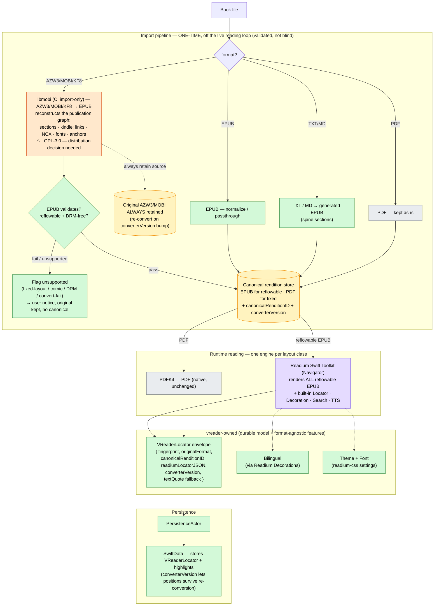
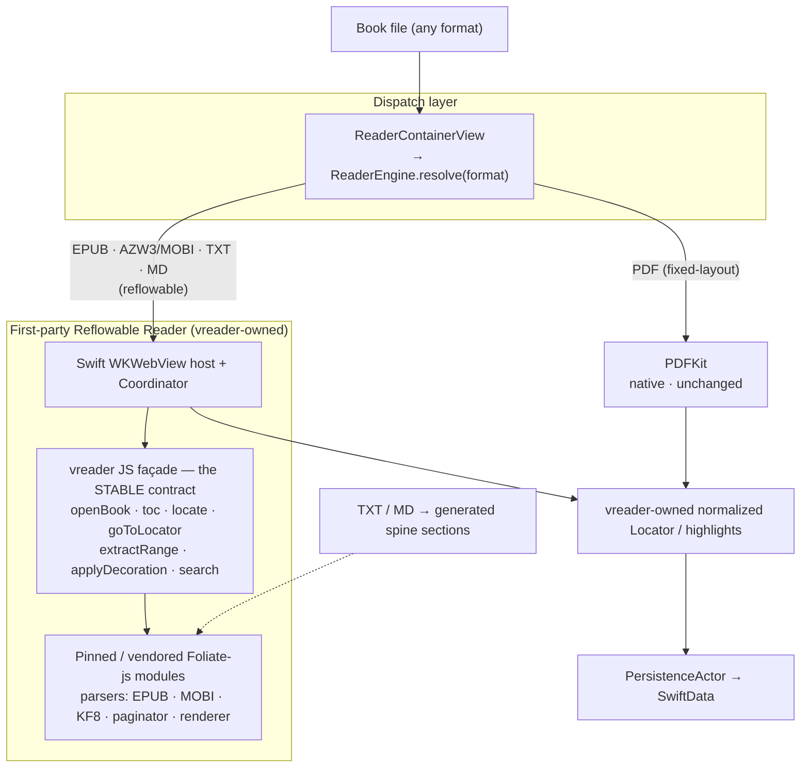

# Feature #42 (re-scoped) — Unified reader engine: Readium + libmobi (convert-on-import)

| | |
|---|---|
| **Feature** | #42 (re-scoped 2026-05-28; supersedes the deferred Foliate-js EPUB-swap scope) |
| **Status** | DEFERRED → Gate-1 plan **DRAFT**. Not greenlit. Gated on the open decisions below + an explicit go-ahead. |
| **Gate** | Gate 1 (Plan) — DRAFT. Gate 2 (independent audit) **pending**. |
| **Author** | claude (orchestrator) |
| **Provenance** | Converged from web research + four Codex consults (migration cost explicitly off the table). A formal Gate-2 audit of *this written plan* is still required before PLANNED. |

> **Scope guard.** This is a *direction-setting* Gate-1 draft. The file-by-file surface
> area, work-item sequencing, and test catalogue (the rest of the rule-47 Gate-1
> requirements) are sketched, not complete — see "Gate-1 completion TODO". Do **not** start
> Gate-3 implementation from this draft.

---

## Problem

vreader renders five formats across three engine families: TextKit (TXT/MD), a bespoke
`EPUBWebViewBridge` (EPUB), Foliate-js (`FoliateSpikeView`, AZW3/MOBI), and PDFKit (PDF).
The same visual effect (theme, font, highlight, bilingual, locator) is implemented 3+ times,
and the per-format divergence is the root of a recurring bug class — this session alone:
#260 (AZW3 chrome), #262/#1136 (AZW3 TOC/nav), #265 (AZW3 position not restored),
#266 (bilingual misalignment). The durable position/highlight model leaking each engine's
internal representation is the common thread.

**Goal:** one runtime reflowable engine + a vreader-owned, engine-agnostic locator/highlight
model, so the cross-format bug class collapses and appearance is modified in one place.

---

## Decision

**Adopt Option B — Readium Swift Toolkit as the single runtime reflowable engine; libmobi
converts AZW3/MOBI/KF8 → EPUB at import; PDFKit keeps PDF. Foliate-js, `EPUBWebViewBridge`,
and `FoliateSpikeView` are eliminated.**

Why B over the earlier Option A (first-party engine over vendored Foliate-js): Readium ships
the **standardized `Locator` model + Decoration (highlight) API + search + TTS** out of the
box — i.e. it *provides* the "stable position/highlight abstraction" that was Option A's #1
risk, rather than vreader building it over an explicitly-unstable JS upstream. Codex's
fourth-consult verdict: *"Use Readium as the only runtime reader engine for reflowable books;
treat Kindle formats as import formats, not render formats."*

---

## Target architecture (recommended — Option B)

**Legend:** 🟧 libmobi — import-only C dep (⚠ LGPL-3.0) · 🟪 Readium — mature 3rd-party runtime
engine · 🟩 vreader-owned · ⬜ native PDFKit · 🟨 canonical-rendition store.

### Load-bearing ideas

1. **Kindle is converted once at import** (`libmobi` AZW3/MOBI/KF8 → EPUB), off the live read
   loop — so the slow KF8 HUFF/CDIC decompression is paid once, not per-open, and no unstable
   parser runs in the read path.
2. **Readium is the single runtime reflowable engine** and *provides* Locator + Decoration +
   search + TTS — vreader inherits the hard abstraction instead of building it.
3. **vreader owns a thin `VReaderLocator` envelope** wrapping Readium's Locator JSON +
   `converterVersion`, so saved positions survive a future re-conversion. The durable model
   stays vreader's; never persist a raw engine-internal anchor.
4. **Kindle import is a *validated pipeline*, not a blind transform** (Codex's condition). The
   real fidelity risk is libmobi's *publication-graph reconstruction* (sections · `kindle:`
   links · NCX · embedded/deobfuscated fonts · hybrid KF7+KF8 · anchors) — NOT WebKit layout,
   which is identical to Foliate's (both render the same extracted KF8 HTML/CSS). Path: convert
   → EPUB-validate → pass ⇒ canonical store; fail / fixed-layout / DRM ⇒ flag + keep original.

### Delta vs today

- **Deletes:** `EPUBWebViewBridge` + bespoke JS; `FoliateSpikeView` + the dead
  `FoliateReaderContainerView`/`FoliateReaderHost` duplicate; the TextKit reader paths for
  TXT/MD; the whole Foliate-js vendored bundle.
- **Adds:** Readium Swift Toolkit (SPM); libmobi (vendored C + Swift binding, import-only);
  the import/conversion pipeline; `VReaderLocator`.
- **Keeps:** PDFKit, `PersistenceActor` / SwiftData (schema extended for `VReaderLocator`).

---

## Rejected alternatives

- **Option A — first-party reflowable engine over vendored Foliate-js** (the earlier draft;
  diagram retained below for the record). Rejected because it forces vreader to build and own
  the Locator/highlight abstraction (the #1 risk) over an explicitly-unstable JS upstream,
  whereas Readium supplies that abstraction. Foliate's only unique advantage — native Kindle
  *rendering* — is neutralised by the fact that nothing renders AZW3 "natively" anyway (KF8 is
  internally HTML/CSS; every engine extracts-and-renders), so libmobi convert-on-import gives
  comparable fidelity for DRM-free reflowable books.
- **Drop Kindle, Readium-only.** Cleanest foundation, but removes a vreader differentiator
  (AZW3/MOBI support). Only correct if the product decides Kindle is non-core.
- **One engine including PDF via pdf.js.** Rejected — PDFKit is the mature native fixed-layout
  engine; pdf.js adds JS memory/render-scheduling/fidelity cost for no pipeline gain.

Option A diagram (rejected — kept for the record)

---

## Open decisions (BLOCKERS — must clear before this leaves DEFERRED)

1. **libmobi is LGPL-3.0-or-later.** App Store distribution/linking needs a deliberate legal
   decision (dynamic-link/framework mitigation so users can relink, or an alternative parser).
   This can *block Option B outright* depending on vreader's distribution posture — resolve first.
2. **Kindle conversion fidelity** across the long tail (legacy MOBI/KF7, hybrid MOBI, embedded
   fonts, dictionaries, fixed-layout/comics, Amazon-specific markup, DRM). Mitigation = the
   validated ingest pipeline (validate + keep-original + flag/fallback) **plus** a pre-commit
   spike: convert a real `.azw3`/`.mobi` corpus via libmobi, EPUB-validate, eyeball output.
3. **Explicit go-ahead.** Per the project's design/feature-workflow rule, implementation does
   not start without an explicit decision to proceed.

---

## Gate-1 completion TODO (before Gate-2 audit)

This draft sets direction; the following rule-47 Gate-1 sections still need to be written:

- **Surface area, file-by-file** — concrete types/signatures: the `VReaderLocator` model +
  SwiftData schema migration; the Readium `Navigator` host (replacing the per-format hosts in
  `ReaderContainerView`); the import/conversion service + libmobi Swift binding wrapper; the
  bilingual-via-Decorations adapter; theme/font via readium-css; the "files OUT of scope" list.
- **Work-item sequencing** — small testable WIs (see first-cut sketch).
- **Test catalogue** — incl. the Kindle-conversion corpus gate (EPUB2/3, RTL/CJK, malformed,
  huge TXT/MD, MOBI, AZW3/KF8, hybrid, fonts, highlights, search, reopen/resume).
- **Backward compat** — migrating existing readers' saved positions/highlights (current
  per-format locators → `VReaderLocator`), and existing imported AZW3/MOBI (convert on upgrade).

### First-cut WI sketch (indicative, not final)

1. WI-0: decision spikes — libmobi LGPL strategy + a libmobi→EPUB fidelity corpus spike.
2. WI-1: `VReaderLocator` model + SwiftData migration (foundational).
3. WI-2: import/conversion service (libmobi binding) + validated pipeline + keep-original.
4. WI-3: Readium Navigator host for EPUB; route `ReaderEngine.resolve` reflowable → Readium.
5. WI-4: position save/restore via `VReaderLocator` ↔ Readium Locator.
6. WI-5: highlights/annotations via Readium Decoration API.
7. WI-6: search + TTS via Readium.
8. WI-7: bilingual via Readium Decorations.
9. WI-8: theme/font via readium-css.
10. WI-9: TXT/MD → generated EPUB (windowed) through the same path.
11. WI-N (final): delete `EPUBWebViewBridge`, `FoliateSpikeView`, dead Foliate trio, TextKit
    reader paths; full acceptance pass; flip DONE → VERIFIED.
